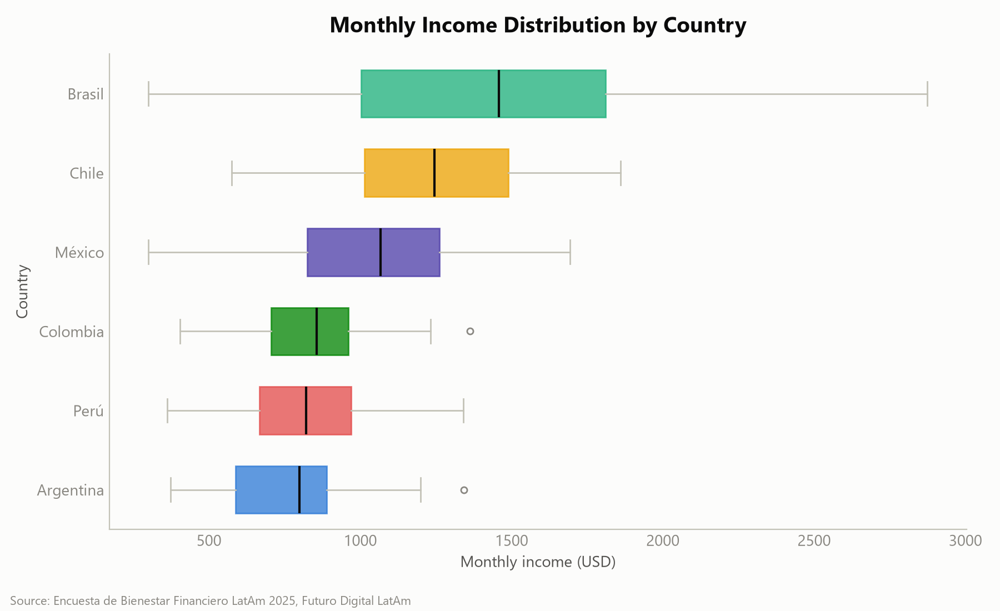
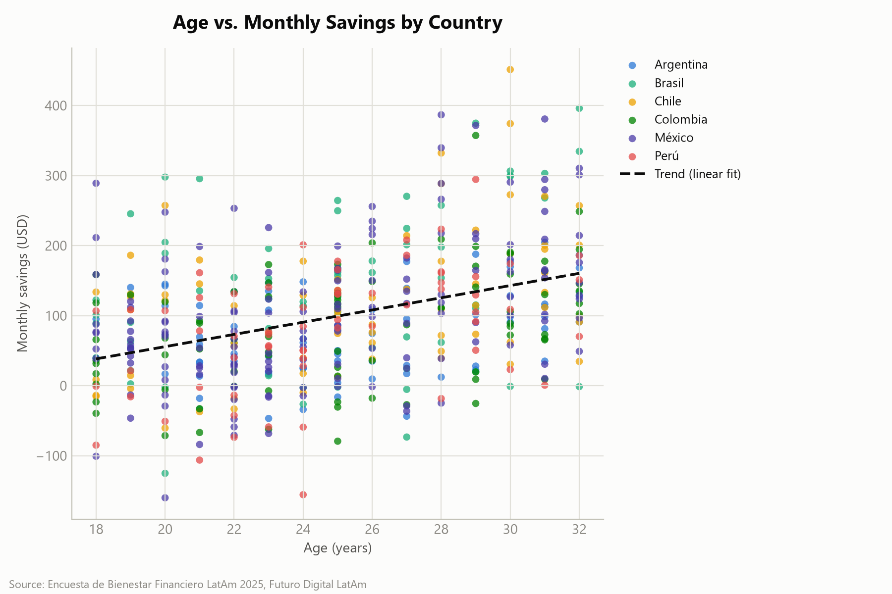
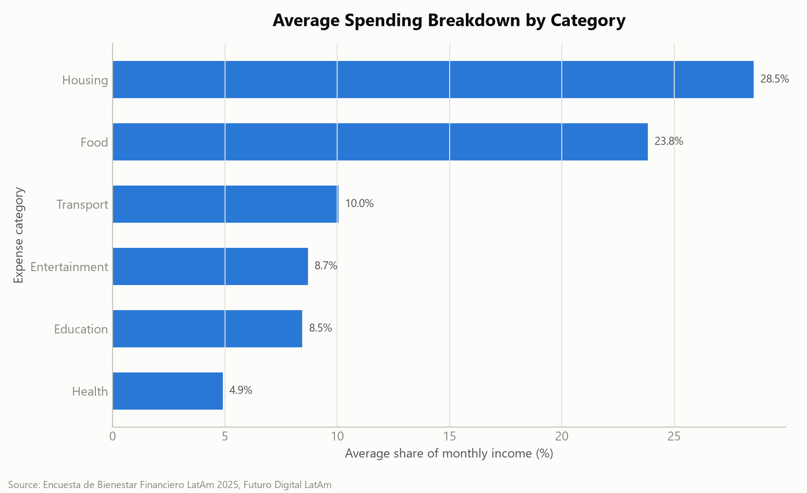
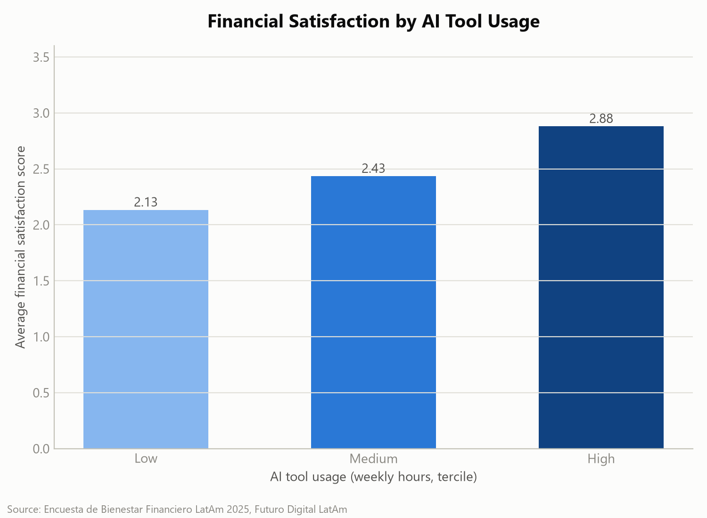
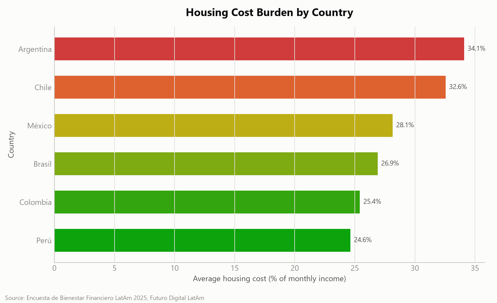

# Datos que Hablan: Bienestar Financiero de Jóvenes Profesionales en América Latina
## Informe Ejecutivo — Futuro Digital LatAm, 2025

### 1. Resumen Ejecutivo

This report analyzes a survey of **500 young professionals** (ages 18–32) across six Latin American countries to inform the design of Futuro Digital LatAm's financial literacy programme. Three findings stand out. First, monthly income varies enormously by country — from a median of **$1,458** in Brazil to just **$798** in Argentina, an 83% gap — meaning fixed, dollar-based curriculum benchmarks will misfire in lower-income markets. Second, savings behavior is heavily age-dependent: average monthly savings more than double, from **$61 (5.7% of income)** among 18–22 year-olds to **$154 (15.5%)** among 29–32 year-olds, identifying the first years of a career as the highest-risk window for weak savings habits. Third, housing (28.5% of income) and food (23.8%) together consume over half of the average participant's budget, far outweighing discretionary categories like entertainment (8.7%) — so generic "spend less on fun" advice targets the wrong problem.

Two recommendations follow directly: (1) localize savings and budgeting benchmarks as a percentage of local median income, piloting first in Argentina, Peru, and Colombia; and (2) build a dedicated "first job, first budget" track for 18–25 year-olds that instills automatic savings habits before financial routines calcify.

### 2. Metodología

- **Dataset:** Encuesta de Bienestar Financiero 2025
- **Sample:** 500 respondents across 6 countries (Argentina, Brazil, Chile, Colombia, Mexico, Peru), ages 18–32
- **Data collection and processing approach:** The raw survey export (`data/latam_finanzas_2025.csv`, 500 rows × 21 columns) was first profiled for structure, missing values, and category consistency (`scripts/01_explore.py`), then cleaned into an analysis-ready dataset (`data/latam_finanzas_clean.csv`) via `scripts/02_clean.py`. Cross-cutting statistical analyses (income, age, spending, credit card usage, AI tool usage, housing burden) were run in `scripts/03_analysis.py`, per-country profiles were generated via a dedicated country-profiler agent, and five summary charts were produced in `scripts/04_visualize.py`.

**Data quality issues found and how they were resolved:**

| Issue | Detail | Resolution |
|---|---|---|
| Inconsistent industry labels | The `industria` field contained **13 raw spelling/casing variants** across 10 real categories (e.g., `"tech"`, `"Tecnologia"`, `"TECNOLOGÍA"`, and `"Tecnología"` all referring to the same industry) | Mapped all variants to a single canonical label per industry (e.g., all four Tecnología variants collapsed into one), preserving all 10 true categories |
| Missing values | `gasto_salud_usd` (healthcare spending) had **33 missing values (6.6%** of rows); all other numeric columns were complete | Filled with the column median to preserve sample size, rather than dropping rows and losing data from every other analysis |
| Negative savings | **74 respondents (14.8%)** had negative `ahorro_mensual_usd`, meaning reported spending exceeded reported income | Kept as valid — overspending is a real and relevant financial-wellness signal, not a data error — and flagged with a new boolean column, `ahorro_negativo`, for downstream analysis. No rows were removed or values altered. |

No rows were dropped at any stage; all 500 respondents are represented in every analysis below.

### 3. Perfil de la Muestra

The sample comprises 500 respondents across six countries, unevenly distributed, with Mexico contributing the largest share:

| Country | Respondents | % of sample |
|---|---:|---:|
| Mexico | 150 | 30.0% |
| Colombia | 80 | 16.0% |
| Argentina | 70 | 14.0% |
| Chile | 70 | 14.0% |
| Brazil | 65 | 13.0% |
| Peru | 65 | 13.0% |

**Age:** Respondents range from 18 to 32 years old (mean **24.96**, median 25), distributed across four age bands with the youngest cohort being the largest:

| Age group | Respondents | % of sample |
|---|---:|---:|
| 18–22 | 162 | 32.4% |
| 23–25 | 123 | 24.6% |
| 26–28 | 87 | 17.4% |
| 29–32 | 128 | 25.6% |

**Industries:** Respondents span 10 industries, led by Finance (**66**, 13.2%), Technology (57, 11.4%), and Engineering (53, 10.6%), down to Retail (41, 8.2%) — a fairly even spread with no single industry dominating the sample.

**Occupations:** The most common roles are Graphic Designer (56), Engineer (55), Community Manager (52), Project Manager (51), Accountant (50), and Financial Analyst (50), reflecting the sample's cross-industry composition rather than concentration in a single professional track.

**Financial profile of the sample:**
- **284 respondents (56.8%)** hold a credit card; 216 (43.2%) do not.
- **362 respondents (72.4%)** hold a savings account; 138 (27.6%) do not.
- **234 respondents (46.8%)** report having debt.
- The most common financial goal is paying off debt (81 respondents), followed by investing in the stock market (75) and saving for retirement (68).
- **74 respondents (14.8%)** report negative monthly savings (spending exceeds income).

### 4. Hallazgos

#### 4.1 Income differences across Latin American countries

Median monthly income ranges from **$1,458** in Brazil down to just **$798** in Argentina — a gap of nearly $660, or 83% — with Chile ($1,246) and Mexico ($1,067) in the middle tier and Colombia ($857) and Peru ($822) at the lower end.

This nearly two-fold spread means a single, one-size-fits-all curriculum will misjudge relevance in at least some markets: budgeting benchmarks and savings targets that feel achievable in Brazil may feel discouraging or irrelevant in Argentina or Peru. See **Figure 1** (`charts/01_income_by_country.png`).

#### 4.2 The relationship between age and savings behavior

Savings behavior rises sharply with age: average monthly savings more than double from **$61 (5.7% of income)** among 18–22 year-olds to **$154 (15.5% of income)** among 29–32 year-olds, with a steady step-up in every age band in between.

This suggests the earliest career years are the highest-risk window for weak savings habits — likely because entry-level earners are still building routines, not because they can't save at all, since the savings rate nearly triples over just one decade. See **Figure 2** (`charts/02_age_vs_savings.png`).

#### 4.3 Where the biggest expense categories are

Housing (**28.5%** of income) and food (**23.8%**) together consume over half of the average participant's income, dwarfing transport (10.1%), entertainment (8.7%), education (8.5%), and healthcare (4.9%) combined.

This tells us that discretionary-spending advice — the kind of "cut back on entertainment" tips common in generic financial literacy content — will have limited impact, since the two categories draining the most income (housing and food) are largely non-discretionary. See **Figure 3** (`charts/03_spending_breakdown.png`).

#### 4.4 How credit card holders differ from non-holders

Credit card holders spend **16% more on food** ($258 vs. $222) and **17% more on entertainment** ($95 vs. $81) than non-holders, despite earning almost the same income (a difference of just 1.5%, $1,023 vs. $1,008).

Encouragingly, holders still save slightly more on average ($102 vs. $95, a 6.7% difference), suggesting credit access is not uniformly destructive to savings — but the elevated spending in discretionary-adjacent categories signals a real risk of lifestyle creep and revolving debt if usage isn't paired with awareness. (Not visualized in the five summary charts; see `scripts/03_analysis.py`, `credit_card_comparison()`.)

#### 4.5 The relationship between AI tool usage and financial satisfaction

Financial satisfaction (on a 1–5 scale) climbs consistently with weekly AI tool usage: from **2.11** among low users (0–3 hrs/week, n=150) to **2.60** among medium users (4–10 hrs/week, n=335) to **3.53** among high users (11+ hrs/week, n=15), a strong positive correlation (**r = 0.57, p < .001**).

However, high users also report the highest average income ($1,895, more than double the low-usage group's $776), so income is likely a confounding factor — and with only 15 people in the high-usage group, that segment's average is also more outlier-sensitive than the other two, so this data shows association, not proof that AI tools alone drive satisfaction. See **Figure 4** (`charts/04_satisfaction_by_ai_usage.png`).

#### 4.6 Housing burden differences by country

Housing consumes **34.1%** of income in Argentina and **32.6%** in Chile — well above Mexico (28.2%), Brazil (26.9%), Colombia (25.4%), and Peru (24.6%) — meaning young professionals in the two highest-burden countries have roughly 8–10 percentage points less income available for savings or other essentials purely due to housing costs.

Notably, this ranking is nearly the inverse of the income ranking in Finding 4.1 (Argentina has the lowest income but the highest housing burden), compounding financial strain in that market specifically. See **Figure 5** (`charts/05_housing_burden_by_country.png`).

### 5. Recomendaciones

1. **Localize benchmarks by local median income, pilot in the lowest-income markets.** With median income ranging 83% between Brazil and Argentina (Finding 4.1), express savings and budgeting targets as a percentage of local median income rather than fixed dollar figures, and pilot country-specific versions in Argentina, Peru, and Colombia before a regional rollout.

2. **Launch a "first job, first budget" track for 18–25 year-olds.** Since average savings rates nearly triple between the 18–22 and 29–32 age bands (Finding 4.2), prioritize a dedicated track for the youngest cohort that introduces automatic savings habits early, rather than assuming savings education matters equally across all age groups.

3. **Shift curriculum emphasis from discretionary cuts to fixed-cost optimization.** Because housing and food alone consume over half of average income while entertainment accounts for under 9% (Finding 4.3), replace generic "spend less" advice with negotiation and optimization strategies for fixed costs — shared housing arrangements, meal planning, and food-cost budgeting tools.

4. **Introduce a responsible credit-use module for cardholders.** Credit card holders spend 16–17% more on food and entertainment than non-holders despite near-identical income (Finding 4.4), so a module distinguishing convenience spending from overspending should be introduced for participants who hold or are about to obtain a credit card.

5. **Prioritize Argentina and Chile for a housing-cost module, and offer AI tools as a supplementary — not core — resource.** Housing consumes 32–34% of income in these two countries, nearly the inverse of their income ranking (Finding 4.6), warranting a dedicated module on shared housing, subsidy programmes, and rent negotiation. Separately, since AI tool usage correlates with higher financial satisfaction even after accounting for likely income effects (Finding 4.5), incorporate AI-based budgeting tools as a supplementary resource — framed as a complement to core training, not a replacement, given the small high-usage sample (n=15) underlying that correlation.

### 6. Conclusión

This data paints a picture of financial wellness shaped less by individual discipline than by structural cost pressures: income varies nearly two-fold across countries, housing and food absorb over half of the average budget, and the years right after entering the workforce are when savings habits are most fragile. Encouragingly, savings behavior improves substantially with age, and neither credit access nor AI tool adoption appears to undermine financial outcomes — suggesting that targeted, localized interventions in the earliest career years, focused on fixed costs rather than discretionary spending, offer the clearest path to improving financial wellness among young Latin American professionals.
